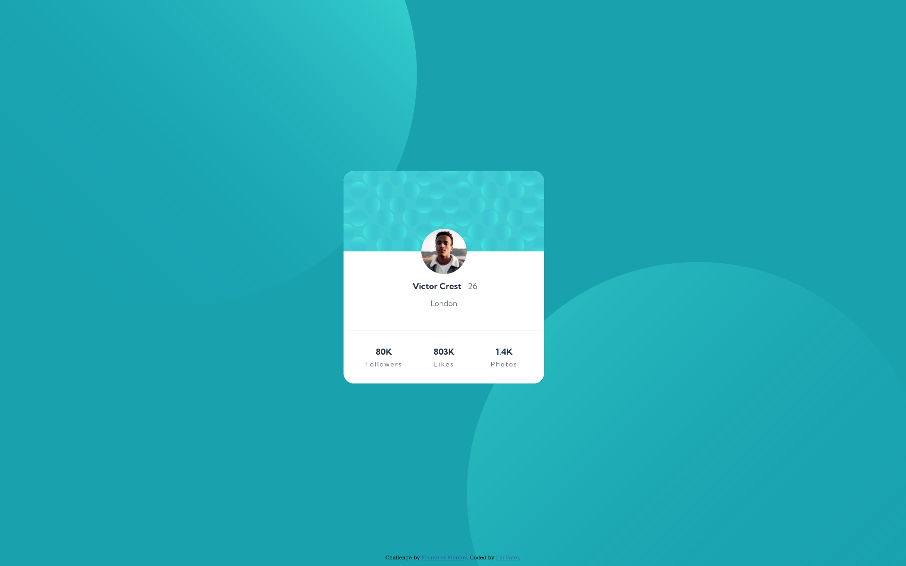

# Frontend Mentor - Profile card component solution

This is a solution to the [Profile card component challenge on Frontend Mentor](https://www.frontendmentor.io/challenges/profile-card-component-cfArpWshJ). Frontend Mentor challenges help you improve your coding skills by building realistic projects. 

## Table of contents

- [Overview](#overview)
  - [The challenge](#the-challenge)
  - [Screenshot](#screenshot)
  - [Links](#links)
- [My process](#my-process)
  - [Built with](#built-with)
  - [What I learned](#what-i-learned)
  - [Continued development](#continued-development)
- [Author](#author)

## Overview

### The challenge

- Build out profile card component closest to the design provided.

### Screenshot

### Links

- Solution URL: (https://github.com/laipatel/Profile_Card_Component/)
- Live Site URL: (https://laipatel.github.io/Profile_Card_Component/)

## My process

### Built with

- HTML
- CSS
- CSS Flexbox
- CSS Grid
- [Normalize.css](https://necolas.github.io/normalize.css/)

### What I learned

- Learned how to position elements within another element using relative and absolute positioning.
- Learned how to incorporate CSS Flexbox and CSS Grid together.
- Learned how to work with web fonts.
- Learned how to incorporate different media within the page using CSS.

### Continued development

I have learned through the [MDN Web Docs](https://developer.mozilla.org/en-US/docs/Learn/HTML/Multimedia_and_embedding/Images_in_HTML#css_background_images) that you should use CSS for decorative images and HTML for images that have meaning within the webpage. However, positioning the decorative background circles so that it supports all resolutions without using the HTML image element was difficult (and still not correctly implemented). This is what I had the main issue with and spent the majority of the time on. I would like to learn how to position the background circles so that they are pinned to the top left and the bottom right and approach the top center and the bottom center as the screen shrinks for a more responsive design.

** Update (10-15-2021): ** Thanks to [@OmKakatkar](https://www.frontendmentor.io/profile/OmKakatkar) on Frontend Mentor for the help with the background circles. They now look similar to the design provided. 

## Author

- Frontend Mentor - [@laipatel](https://www.frontendmentor.io/profile/laipatel)
- LinkedIn - [Lai Patel](https://www.linkedin.com/in/laip/)
